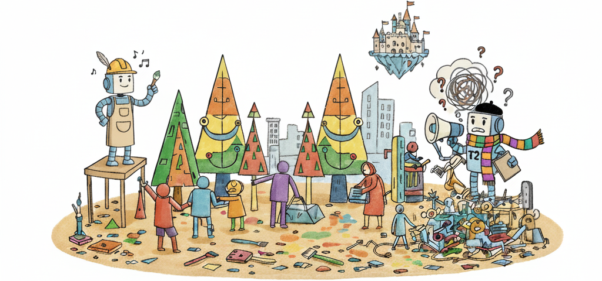

<div align="center">
  
</div>

<div align="center">

  <h1>
  Easier Painting Than Thinking: Can Text-to-Image Models <br>
  Set the Stage, but Not Direct the Play?
  </h1>

  <p align="center">
    <a href='https://t2i-corebench.github.io/'>
      
    </a>
    <a href='https://arxiv.org/abs/2509.03516'>
      
    </a>
    <a href='https://huggingface.co/datasets/lioooox/T2I-CoReBench'>
      
    </a>
    <a href='https://huggingface.co/datasets/lioooox/T2I-CoReBench-Images'>
      
    </a>
    <a href='https://github.com/KwaiVGI/T2I-CoReBench'>
      
    </a>
  </p>

  [**Ouxiang Li**](https://scholar.google.com/citations?user=g2oUt1AAAAAJ&hl=en)<sup>1*</sup>, [**Yuan Wang**](https://scholar.google.com/citations?user=jCmA4IoAAAAJ&hl=en)<sup>1</sup>, [**Xinting Hu**](https://scholar.google.com/citations?user=o6h6sVMAAAAJ&hl=en)<sup>2†</sup>, [**Huijuan Huang**](https://scholar.google.com/citations?hl=en&user=BMPobCoAAAAJ)<sup>3‡</sup>, [**Rui Chen**](https://scholar.google.com/citations?hl=en&user=bJzPwcsAAAAJ)<sup>3</sup>, [**Jiarong Ou**](https://scholar.google.com/citations?user=DQLWdVUAAAAJ&hl=en)<sup>3</sup>, <br>
  [**Xin Tao**](https://scholar.google.com/citations?user=sQ30WyUAAAAJ&hl=en)<sup>3†</sup>, [**Pengfei Wan**](https://scholar.google.com/citations?user=P6MraaYAAAAJ&hl=en)<sup>3</sup>, [**Fuli Feng**](https://scholar.google.com/citations?user=QePM4u8AAAAJ&hl=en)<sup>1</sup>

  <sup>1</sup>University of Science and Technology of China, <sup>2</sup>Nanyang Technological University, <sup>3</sup>Kuaishou Technology
  <br>
  <sup>*</sup>Work done during internship at KwaiVGI, Kuaishou Technology. <sup>†</sup>Corresponding authors. <sup>†</sup>Project leader.

</div>


**Statistics of T2I-CoReBench.** *Left*: Our T2I evaluation taxonomy spanning two fundamental generative capabilities (i.e., *composition* and *reasoning*), further refined into 12 dimensions. *Right*: Distributions of prompt-token lengths and checklist-question counts. Our benchmark demonstrates high complexity, with an average prompt length of 170 tokens and an average of 12.5 questions. Note: reasoning has fewer questions, as each requires reasoning that is more challenging.

## 📣 News
- `2025/09` :star2: We have released our benchmark dataset and code.

## Benchmark Comparison


T2I-CoReBench comprehensively covers 12 evaluation dimensions spanning both *composition* and *reasoning* scenarios. The symbols indicate different coverage levels: <span style="font-size:32px; vertical-align: -5px; line-height:1;">●</span> means coverage with high compositional (visual elements > 5) or reasoning (one-to-many or many-to-one inference) complexity. <span style="font-size:16px; line-height:1;">◐</span> means coverage under simple settings (visual elements ≤ 5 or one-to-one inference). <span style="font-size:32px; vertical-align: -5px; line-height:1;">○</span> means this dimension is not covered.

## 🚀 Quick Start

To evaluate text-to-image models on our T2I-CoReBench, follow these steps:

### 🖼️ Generate Images

Use the provided script to generate images from the benchmark prompts in `./data`. You can customize the T2I models by editing `MODELS` and adjust GPU usage by setting `GPUS`. Here, we take *Qwen-Image* as an example, and the corresponding Python environment can be referred to in its [official repository](https://github.com/QwenLM/Qwen-Image).

  ```bash
  bash sample.sh
  ```

If you wish to sample with your own model, simply modify the sampling code in `sample.py`, i.e., the model loading part in `lines 44–72` and the sampling part in `line 94`; no other changes are required.

### 📏 Run Evaluation

Evaluate the generated images using our evaluation framework. We provide evaluation code based on both **Gemini 2.5 Flash** and **Qwen2.5-VL-72B**. For environment setup, please refer to the [Gemini documentation](https://ai.google.dev/gemini-api/docs) (an official API key is required and should be specified in `line 352` of `evaluate.py`) and the [vLLM User Guide](https://docs.vllm.ai/en/latest/getting_started/quickstart.html#installation), respectively. When using **Qwen2.5-VL-72B** for evaluation, our experiments are conducted with 8 × A800 GPUs (80GB); however, our tests confirm that it can also run with 4 × A800 GPUs.

  ```bash
  bash eval.sh
  ```

The evaluation process will automatically assess the generated images across all 12 dimensions of our benchmark and provide a `mean_score` for each dimension in an individual `json` file.


## 📊 Examples of Each Dimension

<p align="center">
  <br>
  <em>(a) Composition (i.e., MI, MA, MR, TR)</em>
</p>

<p align="center">
  <br>
  <em>(b) Deductive Reasoning (i.e., LR, BR, HR, PR)</em>
</p>

<p align="center">
  <br>
  <em>(c) Inductive Reasoning (i.e., GR, AR)</em>
</p>

<p align="center">
  <br>
  <em>(d) Abductive Reasoning (i.e., CR, RR)</em>
</p>

## ✍️ Citation
If you find the repo useful, please consider citing.
```
@article{li2025easier,
  title={Easier Painting Than Thinking: Can Text-to-Image Models Set the Stage, but Not Direct the Play?},
  author={Li, Ouxiang and Wang, Yuan and Hu, Xinting and Huang, Huijuan and Chen, Rui and Ou, Jiarong and Tao, Xin and Wan, Pengfei and Feng, Fuli},
  journal={arXiv preprint arXiv:2509.03516},
  year={2025}
}
```